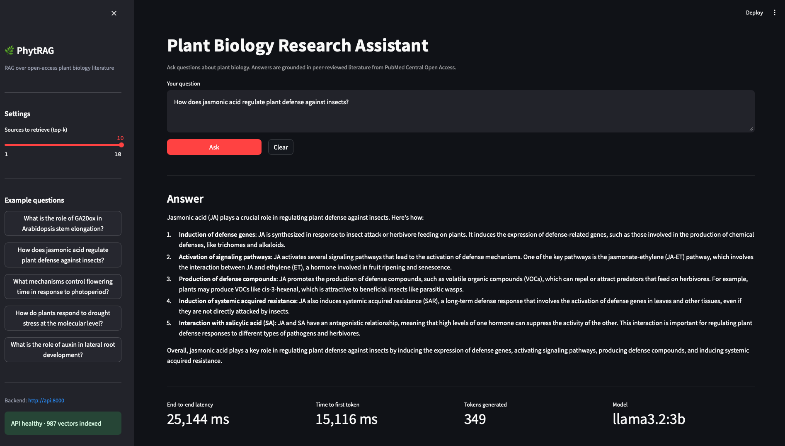
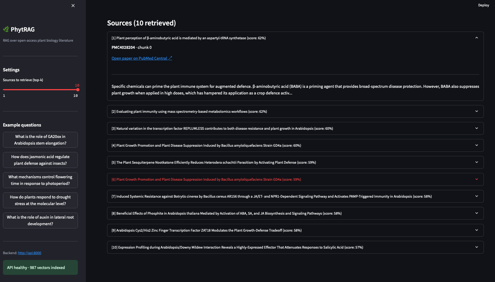
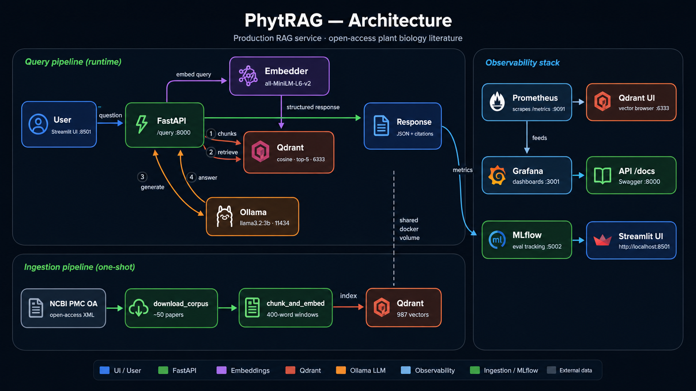

# PhytRAG

> A production-shaped RAG service over open-access plant biology literature.

[](https://github.com/chiragmandal/phytrag/actions/workflows/ci.yml)
[](LICENSE)
[](https://python.org)

Ask natural language questions about plant biology research and receive grounded answers with citations to peer-reviewed literature from PubMed Central Open Access.

**Built to demonstrate production MLOps patterns**: containerised inference serving, vector database operations, Prometheus/Grafana observability, MLflow experiment tracking, and CI/CD for ML artifacts.

---

## Demo

### Streamlit UI

**Answer view** — grounded response with latency metrics:



**Sources view** — ranked retrieved chunks with PubMed Central links:



### REST API

```bash
curl -X POST http://localhost:8000/query \
  -H "Content-Type: application/json" \
  -d '{"q": "What is the role of GA20ox in Arabidopsis stem elongation?"}'
```

```json
{
  "query_id": "3f7a1c2d-...",
  "answer": "GA20 oxidase (GA20ox) catalyses the penultimate step in gibberellin (GA)
             biosynthesis, converting GA20 to bioactive GA1 and GA4. In Arabidopsis,
             overexpression of GA20ox leads to elongated stems, while loss-of-function
             mutants show dwarfism [Source 1, Source 3]...",
  "sources": [
    {
      "pmcid": "PMC3847645",
      "title": "Gibberellin regulation of Arabidopsis stem elongation",
      "score": 0.87,
      "excerpt": "GA20ox1 and GA20ox2 encode the major GA 20-oxidases..."
    }
  ],
  "model": "llama3.2:3b",
  "latency_ms": 4210,
  "ttft_ms": 920,
  "tokens_generated": 112
}
```

---

## Architecture



> Regenerate with `python docs/generate_architecture.py` from the project root.

**Why these tools?**

| Choice | Alternative considered | Reason |
|---|---|---|
| Qdrant | pgvector, Chroma | Production-grade filtering, strong Kubernetes story, Rust performance |
| Ollama (native) | vLLM in Docker | macOS Metal acceleration; same OpenAI-compatible API as vLLM |
| ZenML (ingestion) | Airflow | Python-native, researcher-friendly, low operational footprint |
| all-MiniLM-L6-v2 | all-mpnet-base-v2 | CPU-friendly, fast enough for demo; upgrade path in runbook 03 |

---

## Stack

| Layer | Technology |
|---|---|
| API | FastAPI + Uvicorn |
| Vector store | Qdrant v1.9 |
| LLM serving | Ollama (llama3.2:3b) |
| Embeddings | sentence-transformers all-MiniLM-L6-v2 |
| LLM client | openai Python SDK (OpenAI-compatible) |
| Metrics | Prometheus + Grafana |
| Experiment tracking | MLflow |
| Orchestration | Docker Compose |
| CI/CD | GitHub Actions + GHCR |

---

## Quick Start

### Prerequisites

- Docker Desktop (running, 4 GB+ RAM allocated)
- [Ollama](https://ollama.com) installed: `brew install ollama`
- Python 3.11+

### 1. Pull the LLM (one-time, ~2 GB)

```bash
ollama serve &          # start in background (or open a new terminal)
make setup              # pulls llama3.2:3b
```

### 2. Start the stack

```bash
git clone https://github.com/chiragmandal/phytrag
cd phytrag
make up
```

Services start in ~30 seconds. You should see:

```
Services started:
  API docs:    http://localhost:8000/docs
  Qdrant UI:   http://localhost:6333/dashboard
  Grafana:     http://localhost:3000  (admin/admin)
  MLflow:      http://localhost:5000
  Prometheus:  http://localhost:9090
```

### 3. Ingest plant biology papers

```bash
make ingest
```

This downloads ~50 open-access papers from PubMed Central, chunks them into 400-word passages, embeds each chunk with sentence-transformers, and indexes them into Qdrant. Takes 5 to 10 minutes on first run.

### 4. Query

```bash
make query Q="How does jasmonic acid regulate plant defense against insects?"
```

Or use the interactive Swagger docs at http://localhost:8000/docs.

### 5. Explore the dashboards

Open Grafana at http://localhost:3000, navigate to **Dashboards > PhytRAG > PhytRAG Overview**. Run a few queries and watch the latency percentiles, TTFT, and retrieval scores update in real time.

---

## Development

### Setup

```bash
python -m venv .venv
source .venv/bin/activate
pip install torch --index-url https://download.pytorch.org/whl/cpu
pip install -e ".[dev]"
```

### Tests

```bash
make test
```

Tests are fully mocked: no running services required. Coverage target is 60%.

### Linting

```bash
make lint       # check
make lint-fix   # auto-fix
```

### Retrieval evaluation

```bash
make eval
```

Runs 5 held-out plant biology questions against the indexed corpus, computes Hit@5 and MRR@5, and logs the results to MLflow. Use the MLflow UI to compare runs after changing the embedding model or chunk parameters.

---

## Operational docs

- [Runbook 01: Latency spike](docs/runbooks/01-latency-spike.md)
- [Runbook 02: Qdrant unhealthy](docs/runbooks/02-qdrant-oom.md)
- [Runbook 03: Embedding model upgrade](docs/runbooks/03-embedding-upgrade.md)

---

## What this is and what it is not

**This is** a demonstration of production MLOps patterns applied to a meaningful scientific use case. The same six-layer architecture (data ingestion, orchestration, serving, tracking, packaging, observability) applies directly to serving protein language models (ESM-2, AlphaFold) and genomic LLMs at research organisations.

**This is not** a production system. It runs on a single machine, has no authentication, uses approximate token counting, and does not implement request queuing or rate limiting. Each of these is a known gap and a natural next step.

---

## License

MIT. See [LICENSE](LICENSE).
